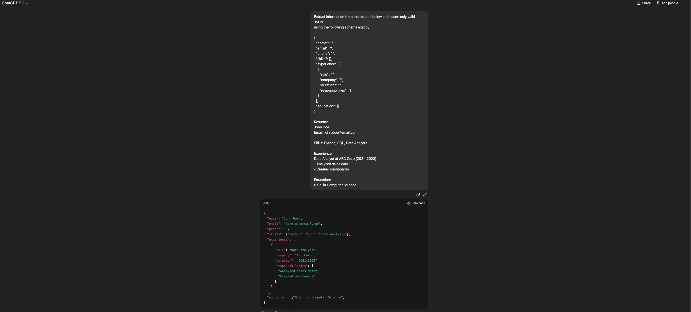

## Structured Output Examples

Below are real examples showing how each prompt converts unstructured input
into reliable, structured output.  
Each screenshot includes the prompt, the raw input, and the structured result.

---

### Resume → JSON

This example demonstrates converting a free-form resume into a strict JSON
schema that can be reused programmatically.

**What this shows:**
- Schema enforcement
- Consistent field structure
- Machine-readable output
- Handling of missing fields without hallucination

---

### Meeting Notes → Action Items

This example shows how unstructured meeting notes are transformed into
clear, assignable action items.

**What this shows:**
- Extraction of actionable tasks
- Clear ownership and deadlines
- Elimination of non-actionable discussion
- Consistent output formatting

---

### Blog Post → SEO Outline

This example demonstrates converting a short blog draft into an
SEO-ready content outline.

**What this shows:**
- Controlled output structure
- Search intent identification
- SEO-focused headings and FAQs
- Reusable outline format for content workflows

---

## Why This Matters

These examples demonstrate practical prompt engineering skills:

- Designing prompts that **control output structure**
- Producing **predictable, reusable results**
- Converting unstructured text into formats suitable for automation
- Applying prompt engineering to real business use cases

The focus of this project is **reliability and structure**, not creative generation.
